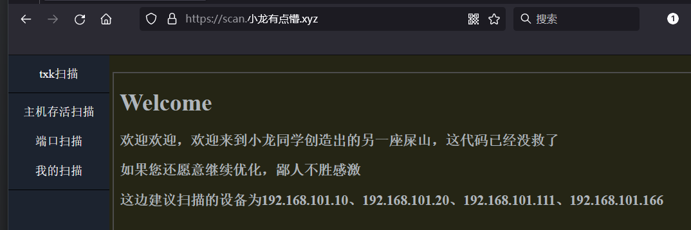
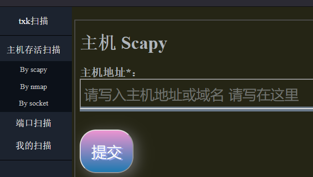

# flask-scan-shi-
花了两个星期写的flask扫描器，正在这边记一下（写的好烂ww）

也是好久没有产出各种各样的学习or生活文章了，总结起来一方面原因是跑出去忙着做项目了，还有很大的一方面原因则是学校方面最终下来的一份大作业，喏，要求像这样


正好来年也就要毕业了，我刚开始的想法就是按照毕业设计的标准去做了。于是脑袋中开始构建架构，预计使用 Flask+Jinja+jQuery+ECharts+MySQL 进行开发，使用 Jinja 透过 Flask 来给前端进行传参，正好也有 [**国光大佬**](https://www.sqlsec.com) 写过了的一篇[**《Django 编写 Web 漏洞扫描器挖坑记录》**](https://www.sqlsec.com/2020/05/webscan.html)来进行入门参考，正好我就参考了下架构，萌生了下用上边的一套组件的念头。

但是考虑到接下任务之后，时间只有两个星期左右，时间又是很吃紧的，再加上我刚开始低估了这一片的前端开发的难度（不好意思前端这边我真的是菜狗ww），所以就导致前端写的很仓促很难看，Echarts 类技术也是没来得及上手使用······ 那么就先不多说那么多有的没的了，下边是正文：

# 系统概述

- 系统目前已开源：**[xiaolongtongxue/flask-scan-shi-(github.com)](https://github.com/xiaolongtongxue/flask-scan-shi-)**

目前系统已经上线本站子域名 scan 上，如果希望体验的话，小伙伴也可以上手感受一下（Web访问密码如果需要请私聊），这边也就以这边的上云版本来进行说明。

## 登录/注册模块

> **未登录状态：**

访问之后会 302 跳转到 `/login/p` 路径下要求登录，登陆界面是这样的


没有账号也可以直接去注册界面太过简单就不说太多了，这边咱们注册一个用户名为 qwe ，密码为某强口令


这就算是登陆成功了呢


> **登录状态**

登陆成功之后也就进入了欢迎界面



这边顺便插入了一句自己的吐槽哈哈哈哈哈哈，只能表示这也是我本人当时刚写完主要内容之后内心的真实写照罢了，后边也是考虑到扫描行为的安全保险性，所以部署上云的设备网卡也进行了一定的限制，希望来玩的小伙伴们也不要乱搞哇！大家好好玩！

> **退出登录**

依此点击 ”我的扫描“ -&gt;”账户信息“，可以查看自己的账号的一些信息；退出登录的话依此点击 ”我的扫描“ -&gt; 即可。

## 主机扫描

这边份三种模式，分别是 Scapy、Nmap 和 Socket 三种模式，其中除了 Socket 模式尚未完善以外，其余两种均可正常运行。

主机扫描主要是为了检验目标主机的存活性，并不进行其他校验，这边的云端部署仅仅是为了简单展示一下功能，真正使用还是希望下载之后慢慢体会（烂成这个样估计也没人会用ww）。下边两张图，是Scapy模式和Nmap模式下的主机扫描的前端样式，过于简陋，十分方便展示。**下边的所有内容点击”提交“之后，后台便会对对应的任务进行扫描，稍后可自行进行查看**



## 端口扫描

端口扫描的话，内容就相对较多一点了，多了一个端口号输入的要求，但是这边也是规定了端口的输入格式，包括了 比如像`22-80`这种从小端口到大端口一系列进行端口扫描，以及像`22,80`这种用逗号分割开来的一个一个的端口，再或者就是80这样的单个端口。当然，**如果你硬是不按照规定的要求来，扫描的结果会给你答案**。同样的，端口扫描最后的结果，也可以在后台进行查看。


## 扫描结果查看

左侧 Banner 依此点击“我的扫描” -&gt; “我的扫描”，就会进入以下窗口中


在这边打印出了对应的用户 id ， 用户权限等级（其实也没做鉴权），以及右侧的一个高级查询查询记录用的表单，在这边点击查询按钮会通过 ajax 发送对应的查询信息并反馈结果，以 table 表格的形式打印在界面上，就像这样


时间紧任务重，来不及做优化了，关于这点等下在代码细节中细说。

# 项目部署

- 项目已开源，需要请自取：**[xiaolongtongxue/flask-scan-shi- (github.com)](https://github.com/xiaolongtongxue/flask-scan-shi-)**

- 首先在对应的 MySQL 环境中运行 sql 目录下的`Create_DB.sql`文件中的 sql 代码，完成建库建表的操作。

- 在`bean.static`包中根据自己的实情对 MySQL 连接的相关信息进行修改。

  ```python
  MYSQL_HOST_IP = "127.0.0.1"
  MYSQL_HOST_PORT = 3306
  MYSQL_USER = "root"
  MYSQL_PASSWD = "123456"
  ```

- 查看`for pip.txt`文件中的内容，使用 pip 配置上对应的包。

  ```
  pip install dnspython
  pip install scapy
  pip install ipaddress
  pip install python-nmap
  pip install mysql-connector-python
  pip install flask
  ```

- 还需要注意的是，环境变量中必须存在 nmap 命令并且可以执行，nmap 类型的功能才可以正常执行！！！

- 这就算配置好了，如果需要配置 运行端口号 以及 Web访问范围 的话，直接在这边改就是了。

  ```python
  RUNNING_PORT = 1888
  RUNNING_HOSTS = "0.0.0.0"
  ```

- 这就算没问题了，运行下边的命令，直接开冲！

  ```bash
  python app.py
  ```

# 代码细节概述

## MySQL连接模块

首先关于 MySQL 的连接信息的配置文件，存放在了`bean.static`包里（这个包里也规定了很多固定化的项目固定化全局变量），具体内容如下。

```python
MYSQL_HOST_IP = "127.0.0.1"
MYSQL_HOST_PORT = 3306
MYSQL_USER = "root"
MYSQL_PASSWD = "123456"
MYSQL_DB = "flask_scan"
```

关于连接数据库的模块则使用了`dao.Connector`包，里边使用的 MySQL 连接用库为 `mysql` ，这边不用`pymysql`主要是为了使用预编译型的 SQL 连接工具用来避免 SQL 注入带来的风险。

- 导包如下：

  ```python
  from mysql import connector
  from mysql.connector import Error
  from bean.static import *
  ```

- 获取MySQL连接的函数`get_connector()`

  ```python
  def get_connector():
      connection = connector.connect(
          host=MYSQL_HOST_IP,
          port=MYSQL_HOST_PORT,
          user=MYSQL_USER,
          password=MYSQL_PASSWD,
          database=MYSQL_DB
      )
      cursor = connection.cursor(prepared=True)
      return [connection, cursor]
  ```

- 运行 insert、update、delete之类的不需要获取运行返回结果的 SQL 语句 ，函数`sql_run1(sql: str, data: tuple)`

  ```python
  def sql_run1(sql: str, data: tuple):
      connection, cursor = get_connector()
      try:
          cursor.execute(sql, data)
          connection.commit()
          if connection.is_connected():
              cursor.close()
              connection.close()
          return INSERT_SUCCESSFULLY
      except Error as error:
          connection.rollback()
          print(f"Error occured : {error}")
          if connection.is_connected():
              cursor.close()
              connection.close()
          return INSERT_REPEAT_NAME
  ```

- 需要运行获取返回结果的 select 系列函数的 SQL 语句。函数`sql_run2(sql: str, data: tuple)`

  ```python
  def sql_run2(sql: str, data: tuple):
      connection, cursor = get_connector()
      try:
          cursor.execute(sql, data)
          select_end = cursor.fetchall()
          connection.commit()
          if connection.is_connected():
              cursor.close()
              connection.close()
          return select_end
      except Error as error:
          connection.rollback()
          print(f"Error occured : {error}")
          if connection.is_connected():
              cursor.close()
              connection.close()
          return SELECT_ERROR
  ```

通过以上函数，可以完美做到针对数据库层面的增删改查操作。

## 登录、注册模块

从 Web 安全的角度来看，在登陆注册的界面是最容易出现 SQL注入、XSS等恶意操作的位置，身为一名安全从业者，这方面必须重视起来，针对这一点，我的设计如下：

> **界面设计**

篇幅原因，CSS层面的前端样式设计不再细说。

`login.html` 源代码如下，其中设计了若干处 Jinja 传参的接口

```html
<script type="text/javascript">
    if ({{ data['alert'] }})
        alert("{{ data['msg'] }}");
</script>
<script>
    function Submit() {
        const random_str = "{{ data['random_str'] }}";
        document.getElementById("password10").value = btoa(document.getElementById("password1").value + random_str);
        document.getElementById("register_submit").submit();
    }
</script>
<div class="form">
    <form action="/login/{{ data['random_str'] }}" method="post">
        <h1>用户登录</h1>
        <div class="txtb">
            <label for="">用户名：</label>
            <input type="text" name="username" id="username" placeholder="请输入用户名"></div>
        <div class="txtb">
            <label for="">密码：</label>
            <input type="password" id="password1" placeholder="请输入密码"></div>
        <input type="hidden" name="password" id="password10">
        <input style="background-color: #8e9eba" type="submit" class="btn" id="btn_sub" value="提交" onclick="Submit()">
        <p>没有账号?<a href="/register/1">立即注册</a></p>
    </form>
</div>
```

- 大体设计：**如果出现登陆失败等情况，则通过 Jinja 传入的参数`data`中的`alert`参数的值为`true`来对参数`msg`的内容进行弹窗输出，该过程为通过GET请求传递参数到这边来。**
- 表单设计：**使用POST请求进行表单发送，请求接口中由 Jinja 传递随机 token 到前端，传递参数的格式为：*将明文密码和随机 token 进行混合之后进行 Base 编码，并根据此原理在后端进行 token 校验*。`关于这一点小小吐槽一下：其实更合适的方法是双方之间互相交换密钥，使用 DH 类的密钥交换算法，但是碍于时间问题，这边就暂时没有对应的设置。`**

### 登录路由接口设计

首先在接口路由处设置接受随机 token，并在后边要求已经登录的用户必须退出登录才能进入登陆界面（注册界面同理）

```python
@app.route("/login/<string:random_str>", methods=['GET', 'POST'])
def login(random_str):
    if session.get(USER_INFORMATION) is not None:
        return redirect("/")
```

如果是 GET 请求传参的话，这时候就涉及到了一个 通过 Jinja 给前端进行参数传递的问题，结合上边提到的前端中的位置设计，这边的data参数是这样设置的，就这样在GET传参的过程中，通过一种又一种的情况，对弹窗的内容加以控制，正常情况下则是不弹窗的。

```python
	if request.method == 'GET':
        session[RANDOM_STR_TOKEN] = get_random_str(RAN_TOKEN_LEN)
        session[LOGIN_FAIL_NUM] = 0
    	data = {
            "random_str": session.get(RANDOM_STR_TOKEN),
            "alert": "false"
        }
        if random_str == xxx:
            data["alert"] = "true"
            data.update({"msg": "就特么你小子是吧？(´ω｀★)"})
        elif xxx:
            xxx
```

后期在审计的时候，在这里发现了一处 bug，当然这里的这一 bug 并不会影响到系统整体的安全性，就是这种登录成功的情况，登陆成功之后会前端渲染 `jump.html`界面，并在其中进行 js 主动跳转界面，内容如下：

```html
如果您的网页没有正常跳转，请<a href="{{ data['target'] }}">点击这里</a>
<script type="text/javascript">
	alert("{{ data['msg'] }}");
	window.location.href="{{ data['target'] }}";
</script>
```

这边是登录成功之后路由的处理方式：

```python
        elif random_str == "success":
            id_value = session.get(USER_INFORMATION)[0]
            username = session.get(USER_INFORMATION)[1]
            level = session.get(USER_INFORMATION)[2]
            data["alert"] = "true"
            data.update({"msg": "登陆成功了哎！好耶！\\n您的ID为：" + id_value + "\\n您的用户名为：" + username + "\\n您的权限等级为：" + str(level),
                         "target": "/"})
            session[LOGIN_FAIL_NUM] = 0
            return render_template("html/tools/jump.html", data=data)
```

如果只是单纯的访问登陆界面准备登录的话，界面应该是这样的：

```python
        return render_template("html/login.html", data=data)
```

当然在某种程度上，如果前后传递的 token 对不上，也是会有一些处理措施的，就像这样(random_str 参数是通过 URI 传参过来的)：

```python
    if session.get(RANDOM_STR_TOKEN) != random_str:
        # Situation1:The hacker changed the token_str.
        get_hacker(request)  # 抓进罐子里。key: HvRRjcgDbeGDEd4EuZeEaiJKC6P74p7LBg9Tv8rp6R
        session[RANDOM_STR_TOKEN] = None
        return redirect("/login/warning")
```

如果存在有人擅自修改数据包的情况，结果自然也是一样，就比如说把数据包中的用户名或密码字段修改为空。

```python
    username = request.form.get('username')
    password = request.form.get('password')
    if username is None or password is None or len(random_str) < RAN_TOKEN_LEN - 1:
        get_hacker(request)  # 抓进罐子里。key: HvRRjcgDbeGDEd4EuZeEaiJKC6P74p7LBg9Tv8rp6R
        session[RANDOM_STR_TOKEN] = None
        return redirect("/login/warning_")
```

之后就可以基本验证请求内容没有什么大问题了，接下来就应该将 Session 中的关于 token 的字段置空。

```python
    session[RANDOM_STR_TOKEN] = None
```

接下来就是登录查询了，调用函数是这样的：

```python
    login_status = login_sql(username=username, passwd_base=password, random=random_str)
    if isinstance(login_status, int):
        if login_status == USERNAME_NOT_EXIST or login_status == PASSWD_ERROR:
            return redirect("/login/passwderror")
    user_id, level_num = login_status
    session[USER_INFORMATION] = [user_id, username, level_num]
    return redirect("/login/success")
```

`login_status`参数调用的函数内容是这样的，如果返回的参数是整数，基本就可以确定是出现了异常情况。

```python
from bean.static import *
from dao.Connector import sql_run2
from util.Encode_Decode.Base import base64_decode
from util.Encode_Decode.Hash_Encode import hash_to_32
def login_sql(username: str, passwd_base: str, random: str):
    id_value = get_id(username=username)
    if id_value is None:
        return USERNAME_NOT_EXIST
    sql = "SELECT level FROM `flask_scan`.`users` WHERE username=? and passwd=?;"
    passwd = base64_decode(passwd_base)[0:-RAN_TOKEN_LEN]
    dump = sql_run2(sql=sql, data=(username, hash_to_32(id_value + passwd)))
    if len(dump) != 1:
        return PASSWD_ERROR
    return [id_value, dump[0][0]]
def get_id(username: str):
    sql = "SELECT id FROM `flask_scan`.`users` WHERE username=?;"
    try:
        return sql_run2(sql=sql, data=(username,))[0][0]
    except IndexError:
        return None
```

### 注册路由接口设计

和登录路由的接口设计相比，也不过只是换汤不换药，接口写法是这样的

```python
@app.route("/register/<string:random_str>", methods=['GET', 'POST'])
def register(random_str):
    xxx
```

唯一不同的可能也就是对 Base64 处理后的密码和确认密码两份数据进行了一次校验吧

```python
    username = request.form.get('username')
    password = request.form.get('password')
    corrpass = request.form.get('correctpwd')
    if password != corrpass:
        # Situation2:The confirm password is not right which is input by the user[ or hacker].
        session[RANDOM_STR_TOKEN] = None
        return redirect("/register/passwdwrong")
```

对应的 sql 调用也很简单

```python
import time
from bean.static import *
from dao.Connector import sql_run1
from util.Encode_Decode.Base import base64_decode
from util.Encode_Decode.Hash_Encode import hash_to_32
def register_sql(username: str, passwd_base: str, random: str):
    id_value = str(int(time.time() * 10000))
    passwd = base64_decode(passwd_base)[0:-RAN_TOKEN_LEN]
    sql = "INSERT INTO `flask_scan`.`users` (id, username, passwd) VALUES (?, ?, ?);"
    if sql_run1(sql=sql, data=(id_value, username, hash_to_32(id_value + passwd))) == INSERT_SUCCESSFULLY:
        print("OK")
        return True
    else:
        return False
```

### 登出路由接口设计

消除 Session 缓存跳转下界面就好啦

```python
@app.route("/log_out", methods=['GET'])
def log_out():
    if session.get(USER_INFORMATION) is None:
        return redirect("/login/p")
    data = {
        "msg": session.get(USER_INFORMATION)[1] + "，您好！您已经成功退出登录！",
        "target": "/"
    }
    session[USER_INFORMATION] = None
    return render_template("html/tools/jump.html", data=data)
```

## Scapy系列

前端内容苟且不提，先来说一下 Scapy 对主机存活扫描以及端口扫描的核心函数，关于这一些全部被安排在了`mapper.scapy`中。

### hosts 字符串转列表

关于这些首先需要考虑到的很重要的一点就是，作为服务端长期部署在服务器上，需要保证在程序不出现大差错的前提下不能够因为报错而停止，所以针对可能出现的情况，这边也在 static 里边设置了很多关于报错相关的常量。

```python
NONE_VALUE = 107014             # 传了个寂寞
VALUE_NUK_LOWERSIZE = 107015    # 端口小于0
VALUE_NUM_OVERSIZE = 107016     # 端口号超过65535
VALUE_NUM_ERROR = 107017        # 传入端口格式为 a-b 或 a1,a2,a3 时，字符串出现格式错误
VALUE_SIZE_ERROR = 107018       # 传入端口格式为 a-b 时，出现 a>b 的情况
DNS_ERROR = 107019              # dns解析出现错误
IPV4_FORMAT_ERROR = 107020      # IPv4格式出错（比如说写了五个数或者单个数字大于等于255）
TARGET_TOO_MANY = 107021        # 网段中指定的 ip 过多，为防止恶意流量行为，从而设置
MIN_MASK_ERROR = 107022         # 子网掩码给了个32或者大于32······
IP_VALUE_ERROR = 107023         # 在ip网段列举其中全部ip地址的时候报错ValueError
```

这边支持用户传入的参数当然也有很多种，所以这边也必须对用户传入的信息进行对应的处理，这边就在 util 包下设计了对应的函数方法`get_hosts_list`，具体的算法内容不再过多赘述，最终返回的结果是一个列表，其中将所有的需要让 scapy 扫描的设备存放了进去，接下来的程序设计就会舒服很多，考虑到可能会传入域名的可能，这边也是引入了和 DNS 解析相关的 python 包。

### 主机存活 ARP 探测

下边的是主要的主机扫描方法设计，中间使用了`bean.MyThread` 类进行了线程加速：

```python
def s_host_scan(hosts: str, dns: bool = False):
    if not dns:
        target_list = get_hosts_list(hosts=hosts)
        if not isinstance(target_list, list):
            return target_list
    else:
        target_list = dns_query(host=hosts)
        if not isinstance(target_list, list):
            return DNS_ERROR
    end = {}
    for target in target_list:
        t = MyThread(arp_scan, (target, None), arp_scan.__name__)
        t.start()
        end.update(t.get_result())
    return end
```

关于针对单个 IP 进行 arp 扫描的情况，函数方法的设计是这样的：

```python
def arp_scan(ip, tmp):
    p = ARP(pdst=ip)
    ans = sr1(p, timeout=5, verbose=0)
    if ans is not None:
        return {ip: {
            "end": True,
            "hwsrc": ans.hwsrc,  # 目的MAC
            "psrc": ans.psrc,  # 被测试ip
            "hwdst": ans.hwdst,  # 本机MAC
            "pdst": ans.pdst  # 本机IP
        }}
    else:
        return {ip: False}
```

整体思路就是：**创建一个ARP数据包，并向目的IP发送出去，设置延迟为5秒，不打印东西，如果成功就获取对应的MAC等信息，如果没有则返回 False，所有的字典数据最终都会整合进需要反馈的大字典里边。**

### 探测端口存活

导包是这样的

```python
from scapy.layers.inet import *
from bean.static import *
from bean.MyThread import MyThread
```

方法是这样写的，关于下边的主要方法，这边必须要说明的是：端口的传入存在很多种情况，比如“22,80”、“22-80”、“22”这样，所以也需要设计成很多中情况，下边的方法就是处理了对应的字符串信息，如果传入的是单个端口则直接开启扫描。

```python
def s_port_scan(target: str = None, port: int = None, ports: str = None):
    if (port is None and ports is None) or target is None:
        return NONE_VALUE
    else:
        if ports is None:
            if port < 0:
                return VALUE_NUK_LOWERSIZE
            if port > 65535:
                return VALUE_NUM_OVERSIZE
            return scan_port1(target=target, port=port)
        else:
            ········
            # 处理大量的字符串相关信息
            return scan_portn(target=target, ports=list(map(int, ports.split(","))))
```

如果传入的是一堆端口，传入的信息就应当被处理成了一组列表，将所有的端口信息导入列表，函数内容也就是多线程调用`scan_port`而已。

```python
def scan_portn(target: str, ports: list):
    end = {}
    for port in ports:
        t = MyThread(scan_port1, (target, port), scan_port1.__name__)
        t.start()
        end.update(t.get_result())
    return end
```

那对于单个端口进行扫描的函数，内容则就是对对应的端口使用 scapy 构造 TCP 包并向目标 IP 发送。

````python
def scan_port1(target: str, port: int):
    ans = sr1(IP(dst=target) / TCP(dport=port, flags="S"), timeout=5, verbose=0)
    if ans is None:
        return {port: True}
    else:
        return {port: False}
````

**当然这一段只支持针对单台主机进行扫描的需求，那么如果需要扫描多台主机的话，那么在调用的时候直接多线程调用扫描窗口就可以了。**

## Nmap系列

由于 nmap 扫描默认不支持`192.168.1.1,192.168.1.2`但是支持`192.168.1.1 192.168.1.2`，也就是支持空格分割但是不支持逗号分割，那么咱么就让他支持，于是就创造了`to_nmap_get_hosts(hosts: str)`函数。

```python
def to_nmap_get_hosts(hosts: str):
    if "," in hosts:
        ips = hosts.split(",")
        hosts = ""
        for ip in ips:
            hosts += ip + " "
    return hosts
```

### 探测主机存活

nmap 如果只是单纯地检查主机是否存活的话，显而易见应当使用**`-sP`**选项，于是这边探测主机存活的情况就写死了扫描的模式，代码如下，不愧是 nmap ，扫描的代码都简单了许多。

```python
import nmap
from util.Get_Hosts_List import to_nmap_get_hosts
def n_host_scan_sP(hosts: str, scan_type: str = "-sP"):
    hosts = to_nmap_get_hosts(hosts=hosts)
    if " " in hosts: hosts = hosts[0:-1]
    hosts_list = hosts.split(" ")
    nm = nmap.PortScanner()
    nm.scan(hosts=hosts, arguments=scan_type)
    hosts_end = [(x, nm[x]['status']['state']) for x in nm.all_hosts()]
    host_alive = []
    for host, status in hosts_end:
        host_alive.append(host)
    end = {}
    for host in hosts_list:
        if host in host_alive:
            end.update({host: True})
        else:
            end.update({host: False})
    return end
```

### 探测端口开放

nmap 用来进行端口扫描的模式就很多了，这边也简单列了一下

| 参数               | 作用                                                 |
| :----------------- | ---------------------------------------------------- |
| -O                 | 系统扫描                                             |
| -V，-v，-D，-d，-p | debug信息                                            |
| –fuzzy             | 推测操作系统检测结果                                 |
| -sT                | TCP端口扫描（完整三次握手）                          |
| -sU                | UDP端口扫描（不回应可能打开，回应则关闭）            |
| -sL                | DNS反向解析                                          |
| -sS                | 隐藏扫描（半开SYN）                                  |
| -sP                | 发现存活主机（直连arp，非直连TCP80，ICMP）           |
| -sO                | 确定主机协议扫描                                     |
| -sW                | 对滑动窗口的扫描                                     |
| -sA                | TCP ACK扫描                                          |
| -sN                | 关闭主机扫描（不管是否存活直接扫描）                 |
| -sF                | fin扫描                                              |
| -sX                | Xmas扫描（fin psh urg为置位）                        |
| -sI                | 完全隐藏（以一个跳板为主机（无流量）扫描另一台主机） |
| -sV                | 服务版本                                             |
| -sC                | 跟安全有关的脚本                                     |
| -PN                | 扫描自己                                             |

这边就需要专门接受一下nmap请求的扫描模式了，代码也很简单，内容如下,默认的扫描模式为“-sV”。

```python
import nmap
from util.Get_Hosts_List import to_nmap_get_hosts
def n_port_scan_sV(hosts: str, ports: str = None, scan_type: str = "-sV"):
    hosts = to_nmap_get_hosts(hosts=hosts)
    nm = nmap.PortScanner()
    nm.scan(hosts=hosts, ports=ports, arguments=scan_type)
    end = {}
    if hosts[-1] == " ": end_ = hosts[0:-1]
    else:  end_ = hosts
    for host in end_.split(" "):
        end_ = {"model": scan_type}
        if host in nm.all_hosts():
            end_.update(dict(nm[host]))
            end.update({host: end_})
        else:
            end.update({host: False})
    return end
```

## 前端技术简述

本项目中使用到的前端技术，主要还是 jQuery，很多位置本来考虑使用 Vue 的，但碍于本人的掌握程度，这个课题就先留到下次吧。

> **main.html**

关于主界面中进行界面嵌套的，这边并没有使用较为灵活的 AJAX 技术，而是采用了对 iframe 标签使用 Jinja 进行传参的方法，这样的方法不是最好的方法，但雀氏是在短时间里最快见效的方法。为了顾全大局，万望见谅。

> **jump.html**

这边为了快速实现跳转的方法，使用了通过 js 在前台进行跳转的方法，同样也是碍于时间的限制，但是想一下也不难发现很多时候访问站点都会弹出一个“如果您的浏览器没有响应，请[点击这里](#)”。

> **ajax获取json生成表格**

要说在写前端的时候最费时间精力的部分是哪一部分？那一定是在个人中心使用高级查询查询我的扫描的时候了，这一段表单使用的是 AJAX 提交的数据，并获取了json代码，并且在指定 id 的 `<div>`标签下打印出了table 表格，方法还是很笨的....看看就彳亍了...

```javascript
function ajax_go() {
    $("#sub").click(function () {
            $.ajax({
                type: "POST",
                url: "/myscan/select",
                data: $("#fm").serialize(),
                async: true,
                error: function (request) {alert("请求失败"); },
                success: function (data_s) {
                    console.log(data_s);
                    const table_place = document.getElementById("table");
                    if (data_s['a'] === 'a') {
                        html = "" +
                            "<table border='1'>" +
                            "<tr>" +
							 ······重复打印
                            "<tr>";
                        for (var i = 0; i < data_s['TableList'].length; i++) {
                            html += "<tr>" +
							 ······重复打印
                                "</tr>";
                        }
                        html += "</table>"
                    } else {
                        html = "" +
                            "<table border='1'>" +
                            "<tr>" +
                            "<td>扫描时间</td>" +
							 ······重复打印
                            "<tr>";
                        for (var ii = 0; ii < data_s['TableList'].length; ii++) {
                            html += "<tr>" +
                                "<td>" + data_s['TableList'][ii]['Scan_Time'] + "</td>" +
							 ······重复打印
                                "</tr>";
                        }
                        html += "</table>"
                    }
                    table_place.innerHTML = html;
                }
            })
        }
    );
}
```


## 数据库相关系列

这一部分来说一下数据库的简单结构吧，长这样。


> **关于 users 用户表**

包括了用户id，另外还有用户名、等级、以及哈希处理过了的密码几个字段


> **关于 host_scan 数据表**

包括了扫描结束时间、扫描id、用户id、扫描模式（三种）、扫描主机、扫描结果原文、错误码


> **关于 ports_scan 数据表**

包括了扫描结束时间、扫描id、用户id、扫描模式（三种）、扫描主机、扫描端口、扫描结果原文、错误码


# 经验教训

花了两个星期写了这么一大堆东西，我本来是照着毕设前身的标准去写的，但是写到后边看着整个混乱不堪的架构实在是不忍直视；再有一点最大的问题就是我太轻敌了，第一次前后端全栈同步开发，难度比我想象得大很多。

所以通过这么一波事情，我最大得感觉就是，在大面积得程序开发前，一定要有一套清晰完整的架构，不要只是印在脑子里，而是需要实打实地做出来，这只是为了规范自己在后边的程序编辑中不至于营造太过离谱的问题跑偏。

尽管这样可能还是避免不了“屎山”的出现，但是规范化一点的架构，总归是好一点的。

# 云端部署参考命令

```bash
# 先创建一个容器来制作镜像
docker run -itd --name flaskxxx --hostname image__ -v /xxx/sources.list:/etc/apt/sources.list ubuntu /bin/bash
# 命令
apt -y update
apt -y install vim
apt -y install net-tools
apt -y install iproute2
apt -y install python3
apt -y install python3-pip
ln -s /usr/bin/python3 /usr/bin/python
pip install flask
pip install dnspython
pip install scapy
pip install ipaddress
pip install python-nmap
pip install mysql-connector-python
# 打包镜像
docker commit -m="My Scan" -a="txk" flaskxxx flask_scan:1
# 创建docker网络
docker network create --driver bridge --subnet 192.168.xx.0/24 --gateway 192.168.xx.1 xxxxxx
# 创建docker
docker run -itd --ip 192.168.101.111 --name flask-xxx --hostname flask_xxx -p 1888:1888 -v /root/sources.list:/etc/apt/sources.list -v /root/py:/root/py --network for_flask flask_scan:1 /bin/bash
docker update flask-xxx --memory="256m" --cpus="1" --memory-swap="-1"
# 配置MySQL
docker run --ip 192.168.101.166 --network for_flask -d -p 3306:3306 -v /home/mysql/conf:/etc/mysql/conf.d -v /home/mysql/data/:/var/lib/mysql -e MYSQL_ROOT_PASSWORD=123456 --name mysql01 mysql:5.7
# 配置待扫描环境
docker run --ip 192.168.xx.xx--network for_flask --name scan-80 -itd httpd:latest
docker run --ip 192.168.xx.xx --network for_flask --name myphp-9000 -d php:5.6-fpm
```
